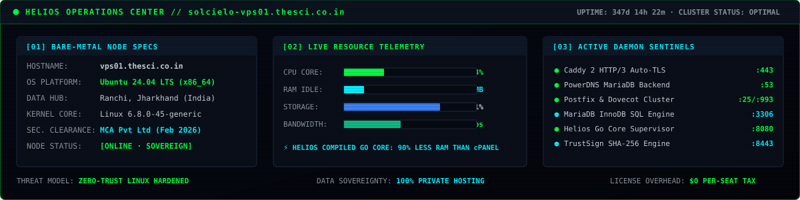

<div align="center">

<!-- Cyberpunk Matrix Rain Hero Banner (Adaptive Dark/Light) -->
<picture>
  <source media="(prefers-color-scheme: dark)" srcset="./assets/header-matrix-rain.svg" />
  <source media="(prefers-color-scheme: light)" srcset="./assets/header-matrix-rain-light.svg" />
  
</picture>

<!-- Dynamic Monospace Typing Ticker (+25% Font Size: size=22) -->
[](https://shivamvishwanaath.dev)

<p align="center">
  <a href="https://shivamvishwanaath.dev"></a>
  <a href="https://thesci.co.in"></a>
  <a href="https://thesci.co"></a>
  <a href="https://he.thesci.co"></a>
  <a href="mailto:shivam.strive@gmail.com"></a>
  <a href="https://x.com/svishwanaath"></a>
  <a href="https://www.instagram.com/shivamvishwanaath/"></a>
</p>

<p align="center">
  
</p>

</div>

<!-- Live Operations Center Dashboard (Adaptive Dark/Light) -->
<picture>
  <source media="(prefers-color-scheme: dark)" srcset="./assets/system-dashboard.svg" />
  <source media="(prefers-color-scheme: light)" srcset="./assets/system-dashboard-light.svg" />
  
</picture>

<br />

<br />

<!-- SESSION 01: EXECUTIVE SUMMARY & CREDENTIALS -->
<details open>
<summary><h3><code>$ cat /proc/identity // EXECUTIVE PROFILE &amp; CREDENTIALS</code></h3></summary>
<br />

```yaml
IDENTITY_SPECIFICATION:
  Subject: Shivam Vishwanaath
  Designation: Founder & CEO · The SCI SolCielo Innovacion Private Limited™
  Concurrent_Role: Tech Lead · Trans Ed (Bhubaneswar, India)
  Specialization: Compiled Go Cloud Infrastructure · Bare-Metal Linux Systems · Enterprise Web Platforms
  Clearance_Status: Ministry of Corporate Affairs (MCA) Incorporated · Active Tech Leadership
  Headquarters: BlueOffice Workspace, Kokar Chowk, Ranchi, Jharkhand, India — 834001
```

I am the **Founder & CEO of [The SCI SolCielo Innovacion Private Limited™](https://thesci.co.in)** — a Ministry of Corporate Affairs (MCA) India registered enterprise technology firm headquartered in Ranchi, Jharkhand. I architect self-hosted, compiled enterprise cloud platforms and unified business application suites that deliver CRM, HRMS, Agile Project Management, Helpdesk, and Cryptographic Digital Signatures at 10x lower Total Cost of Ownership (TCO) compared to bloated SaaS alternatives. Concurrently, I serve as **Tech Lead at Trans Ed**, directing core software architectures for large-scale academic assessment platforms.

- 🏢 **Corporate Entity:** [The SCI SolCielo Innovacion Pvt. Ltd.™](https://thesci.co.in) — Founded 2019, MSME Udyam registered (2024), officially incorporated as Private Limited with MCA India (Feb 2026). Serving SMEs, institutions, and startups across Jharkhand, Bihar, Odisha, and Eastern India.
- 🎓 **Academic Pedigree:** 
  - **MBA in Data Science** — *Amity Online* (2025–2027, Active Cohort)
  - **B.Tech in Electronics & Communication Engineering** — *Birla Institute of Technology (BIT Mesra)* (2021–2025, Completed)
  - **Class XII CBSE (Senior Secondary)** — *Chinmaya Vidyalaya, Bokaro* (2018–2020, Completed with 92% Score)
- 🚀 **Production Scale & Engineering Track Record:** Architected, built, and shipped **10+ production-grade platforms** end-to-end — from compiled Go cloud engines running on ~15MB RAM idle to EdTech exam simulators serving thousands of concurrent aspirants. All hosted on self-managed bare-metal Ubuntu Linux VPS nodes with zero proprietary cloud lock-in.
- 📱 **Published Native Android Apps:** Google Play Store developer carrying chemistry and utility resources with **70+ five-star reviews** and 100% offline-first architecture.
- 🩸 **Humanitarian & Community Leadership:** 
  - **500+ Blood Units** collected in a single 24-hour mega donation drive as NSS Event Head.
  - **300+ Rural & Village Students** taught across **8 remote learning hubs** in Jharkhand and Odisha.
  - **100+ Active Student Members & 250+ Alumni Mentors** networked as President of the Environmental Protection & Awareness Club (EPAC).
- 💬 **Ask Me About:** Systems architecture, compiled Go/Fiber backends, bare-metal VPS server hardening, Caddy 2 reverse proxies, automated Let's Encrypt / ZeroSSL, PowerDNS MariaDB backends, high-concurrency web portals, and building sustainable tech companies from Eastern India.
- 📫 **Direct Dispatch:** [shivam.strive@gmail.com](mailto:shivam.strive@gmail.com) • [contact@thesci.co.in](mailto:contact@thesci.co.in) • [shivamvishwanaath.dev](https://shivamvishwanaath.dev)

</details>

<br />

<br />

<!-- SESSION 02: HELIOS ARCHITECTURE & 5 ENTERPRISE SUITES -->
<details open>
<summary><h3><code>$ helios --inspect-architecture --topology // COMPILED ENTERPRISE PLATFORM</code></h3></summary>
<br />

<div align="center">

<!-- Animated Circuit Topology Diagram -->


<br />

*⚡ Premium Enterprise Technology at 10x Lower Total Cost of Ownership — fully self-hosted, modular, and cryptographically sovereign.*

</div>

### 📦 The Helios Enterprise Platform Suite

| Suite | Core Capabilities | Replaces (Zero Per-Seat Fees) |
| :--- | :--- | :--- |
| ☁️ **Helios Cloud Engine** | Lightweight compiled server management panel (**~15 MB RAM idle**), Caddy 2 reverse proxy, PowerDNS native MariaDB backend, automated SSL, Postfix/Dovecot mail cluster. | cPanel, WHM, Plesk ($40–$60/mo/server) |
| 📊 **Helios-CRM** | Visual drag-drop deal pipeline, proposal & quote builder with PDF generation, weighted revenue forecasting, email correspondence sync, smart deduplication. | Salesforce Sales Cloud, HubSpot ($150/user/mo) |
| 👥 **Helios-HRMS** | Complete employee directory, automated leave accrual & approvals, custom statutory payroll formulas, org hierarchy, onboarding audit ledgers. | BambooHR, Workday, Zoho People ($12–$20/user/mo) |
| 📋 **Helios-PM** | Agile sprint management, customizable Kanban boards, story point velocity metrics, cross-project portfolio overview, **<50ms board renders**. | Jira, Asana, Monday.com ($15–$25/user/mo) |
| 🎧 **Helios-Support** | Multi-channel unified ticket inbox, automated SLA escalation policies, public customer knowledge base CMS, unlimited support agents. | Zendesk, Freshdesk ($49–$99/agent/mo) |
| ✍️ **TrustSign E-Signature** | Tamper-evident SHA-256 PDF signing, email OTP 2FA, drag-drop coordinate placement, immutable legal audit certificate with QR verification. | DocuSign, Adobe Sign ($40/user/mo) |

<div align="center">

🌐 **[thesci.co.in](https://thesci.co.in)** (Corporate India) · **[thesci.co](https://thesci.co)** (Global SaaS Showcase) · **[he.thesci.co](https://he.thesci.co)** (Live Cloud Panel)

</div>

</details>

<br />

<br />

<!-- SESSION 03: COMMERCIAL ENGINEERING SERVICES -->
<details>
<summary><h3><code>$ cat /etc/commercial-services.conf // BESPOKE ENGINEERING OFFERINGS</code></h3></summary>
<br />

Through **The SCI SolCielo Innovacion Private Limited™**, we deliver bespoke enterprise software solutions:

- 🌐 **Custom Website Development:** High-performance, SEO-optimised web platforms engineered in Next.js, TypeScript, Tailwind CSS, and hosted via Helios Cloud Engine.
- ⚡ **Enterprise Web Applications:** High-concurrency custom SaaS, role-based access control (RBAC), and analytics dashboards built in compiled Go / Fiber v2 and MariaDB / PostgreSQL.
- 📱 **Native Android App Development:** Offline-sync native Android applications built with Kotlin, Jetpack Compose, Room database, and Material 3 design principles.
- 🔄 **Cross-Platform Engineering:** Unified 60fps applications for Android, iOS, and Web using Flutter / Dart and React Native.

```
CORPORATE DISPATCH COORDINATES:
  Entity: The SCI SolCielo Innovacion Private Limited™
  MCA Status: Active Private Limited Company (Incorporated Feb 2026)
  MSME Status: Udyam Registered Entity (Registered 2024)
  Office: B7/10, BlueOffice Workspace, 101, 1st Floor, Anantham Building,
          Surendra Singh Compound, Kokar Chowk, Kokar, Ranchi, Jharkhand, India — 834001
  Primary Contact: contact@thesci.co.in
```

</details>

<br />

<br />

<!-- SESSION 04: TECH ARSENAL & WEAPONS MATRIX -->
<details open>
<summary><h3><code>$ cat /dev/arsenal // CONFISCATED WEAPONS &amp; TECH STACK</code></h3></summary>
<br />

<div align="center">
  
</div>

<br />

| Operational Domain | Technologies & Frameworks |
| :--- | :--- |
| **Compiled & Core Languages** | **Go (Golang)**, **TypeScript**, JavaScript (ESNext), Python, C / C++, SQL, Bash / Shell Scripting |
| **Frontend & Web Architecture** | React.js (v18 / v19), **Next.js (App Router / SSG / SSR)**, Tailwind CSS, Framer Motion, **HTMX**, HTML5, CSS3 |
| **Backend & Microservices** | **Go + Fiber v2**, Node.js, Express.js, RESTful APIs, WebSockets, Middleware Pipelines, Task Queues |
| **Databases & Sovereign Storage** | **MariaDB (InnoDB Engine)**, PostgreSQL, MongoDB, Supabase, Firebase Realtime Database / Firestore |
| **DevOps & Cloud Infrastructure** | **Ubuntu Linux VPS (Bare-Metal Hardened)**, **Caddy 2 (HTTP/3 &amp; Auto TLS)**, **PowerDNS (MariaDB Backend)**, Postfix &amp; Dovecot, PM2, Docker, UFW Firewall, CI/CD |
| **Data Science & Diagnostics** | NumPy, Pandas, Predictive Modeling, Diagnostic Assessment Algorithms, Weak-Area Clustering, Telemetry Pipelines |

</details>

<br />

<br />

<!-- SESSION 05: FEATURED PRODUCTION DEPLOYMENTS -->
<details open>
<summary><h3><code>$ ls -la /deployments/production/ // FEATURED PRODUCTION ARTIFACTS</code></h3></summary>
<br />

<table>
  <tr>
    <td width="50%" valign="top">
      <h3 align="center">☁️ Helios Cloud Engine</h3>
      <p><b>Tech Stack:</b> <code>Go</code> <code>Fiber v2</code> <code>MariaDB</code> <code>Caddy 2</code> <code>PowerDNS</code> <code>Ubuntu VPS</code></p>
      <ul>
        <li>Self-hosted compiled cloud hosting &amp; server orchestration platform replacing cPanel/WHM.</li>
        <li><b>~15 MB RAM idle footprint</b> — 90% lighter than legacy PHP/Perl control panels.</li>
        <li>Automated Zero-Touch SSL, native SQL DNS propagation, and Postfix/Dovecot mail cluster.</li>
      </ul>
      <p align="center">
        <a href="https://thesci.co.in"><b>Corporate Portal →</b></a> · <a href="https://he.thesci.co"><b>Live Panel →</b></a>
      </p>
    </td>
    <td width="50%" valign="top">
      <h3 align="center">📊 Helios-CRM Enterprise Suite</h3>
      <p><b>Tech Stack:</b> <code>Go</code> <code>Fiber v2</code> <code>MariaDB</code> <code>HTMX</code> <code>PDF Engine</code></p>
      <ul>
        <li>Self-hosted Salesforce/HubSpot alternative with zero per-seat licensing fees.</li>
        <li>Visual drag-and-drop deal pipeline, dynamic quote builder, and weighted revenue forecasting.</li>
        <li>Integrated TrustSign handoff for closed-won automatic e-signature envelope generation.</li>
      </ul>
      <p align="center">
        <a href="https://shivamvishwanaath.dev/projects/helios-crm-enterprise"><b>View Project Details →</b></a>
      </p>
    </td>
  </tr>
  <tr>
    <td width="50%" valign="top">
      <h3 align="center">👥 Helios-HRMS &amp; PeopleOS</h3>
      <p><b>Tech Stack:</b> <code>Go</code> <code>Fiber v2</code> <code>MariaDB</code> <code>RBAC</code> <code>Audit Ledger</code></p>
      <ul>
        <li>End-to-end workforce directory and employee lifecycle management suite.</li>
        <li>Automated leave balance accrual, multi-tier approvals, and customizable payroll calculation.</li>
        <li>100% private cloud data sovereignty — confidential salary and contract records stay sovereign.</li>
      </ul>
      <p align="center">
        <a href="https://shivamvishwanaath.dev/projects/helios-hrms-enterprise"><b>View Project Details →</b></a>
      </p>
    </td>
    <td width="50%" valign="top">
      <h3 align="center">✍️ TrustSign E-Signature Engine</h3>
      <p><b>Tech Stack:</b> <code>Go</code> <code>SHA-256</code> <code>PDF Signing</code> <code>OTP 2FA</code> <code>QR Verification</code></p>
      <ul>
        <li>Tamper-evident legal digital document signing alternative to DocuSign and Adobe Sign.</li>
        <li>Visual coordinate signature placement, email OTP two-factor authentication, and SHA-256 hashing.</li>
        <li>Automated legal audit certificate generation with public QR code real-time verification.</li>
      </ul>
      <p align="center">
        <a href="https://shivamvishwanaath.dev/projects/trustsign-esign-engine"><b>View Project Details →</b></a>
      </p>
    </td>
  </tr>
  <tr>
    <td width="50%" valign="top">
      <h3 align="center">🎯 CBSEForum &amp; BITSATForum</h3>
      <p><b>Tech Stack:</b> <code>Next.js</code> <code>TypeScript</code> <code>Node.js</code> <code>PostgreSQL</code> <code>Ubuntu VPS</code></p>
      <ul>
        <li>Centralized academic repository and online diagnostic testing engine for Classes 1–12.</li>
        <li>Designed real-time diagnostic recommendation algorithms that cluster conceptual blind spots.</li>
        <li>Hosted on bare-metal Ubuntu VPS with Caddy reverse proxy, HTTP/3, and PM2 clustering.</li>
      </ul>
      <p align="center">
        <a href="https://shivamvishwanaath.dev/projects/cbseforum-bitsatforum"><b>View Project Details →</b></a>
      </p>
    </td>
    <td width="50%" valign="top">
      <h3 align="center">💳 Tutors Forum Marketplace</h3>
      <p><b>Tech Stack:</b> <code>Next.js</code> <code>Express.js</code> <code>MongoDB</code> <code>Billing Engine</code></p>
      <ul>
        <li>Tutor-student marketplace with automated session billing and ledger reconciliation.</li>
        <li>Conflict-free interactive calendar scheduling with multi-timezone synchronization.</li>
        <li>Visual syllabus milestone progress meters for parents and students.</li>
      </ul>
      <p align="center">
        <a href="https://shivamvishwanaath.dev/projects/tutors-forum"><b>View Project Details →</b></a>
      </p>
    </td>
  </tr>
  <tr>
    <td width="50%" valign="top">
      <h3 align="center">📱 Periodic Table Android App</h3>
      <p><b>Tech Stack:</b> <code>Android SDK</code> <code>Java</code> <code>XML</code> <code>Algorithms</code></p>
      <ul>
        <li>100% offline-first native Android utility with sub-10ms element property lookups.</li>
        <li>Published on Google Play Store carrying <b>70+ five-star reviews</b>.</li>
        <li>Custom chemistry search algorithms and dynamic property visualization.</li>
      </ul>
      <p align="center">
        <a href="https://shivamvishwanaath.dev/projects/periodic-table-app"><b>View Project Details →</b></a>
      </p>
    </td>
    <td width="50%" valign="top">
      <h3 align="center">🌐 NM Foundation Dual Portals</h3>
      <p><b>Tech Stack:</b> <code>React.js</code> <code>Node.js</code> <code>PostgreSQL</code> <code>Supabase</code></p>
      <ul>
        <li>Customizable test simulation engine for JEE &amp; NEET entrance examination aspirants.</li>
        <li>Separated Administrator CMS for question authoring and Student timed assessment portal.</li>
        <li>Real-time national percentile and predictive ranking projection engine.</li>
      </ul>
      <p align="center">
        <a href="https://shivamvishwanaath.dev/projects/nm-foundation"><b>View Project Details →</b></a>
      </p>
    </td>
  </tr>
  <tr>
    <td width="50%" valign="top">
      <h3 align="center">🎪 JoharNite Fest Portal</h3>
      <p><b>Tech Stack:</b> <code>React</code> <code>Firebase Hosting</code> <code>MERN</code></p>
      <ul>
        <li>Event registration and contestant ticketing portal for the annual cultural festival.</li>
        <li>Successfully managed traffic spikes of <b>9,300+ concurrent visitors at 99% uptime</b>.</li>
        <li>Optimized database write performance during peak contestant registrations.</li>
      </ul>
      <p align="center">
        <a href="https://shivamvishwanaath.dev/projects/joharnite-qeds-conference"><b>View Project Details →</b></a>
      </p>
    </td>
    <td width="50%" valign="top">
      <h3 align="center">🕵️‍♂️ shivamvishwanaath.dev</h3>
      <p><b>Tech Stack:</b> <code>Next.js</code> <code>TypeScript</code> <code>Tailwind</code> <code>Framer Motion</code></p>
      <ul>
        <li>Interactive high-performance casebook portfolio built with modern UX animations.</li>
        <li>Interactive draggable zoomable Crime Pinboard canvas with custom non-passive event listeners.</li>
        <li>Optimized statically (SSG) with structured JSON-LD schemas and dynamic sitemaps.</li>
      </ul>
      <p align="center">
        <a href="https://shivamvishwanaath.dev/"><b>Inspect Portfolio Live →</b></a>
      </p>
    </td>
  </tr>
</table>

</details>

<br />

<br />

<!-- SESSION 06: PUBLISHED WHITEPAPERS -->
<details>
<summary><h3><code>$ tail -n 20 /var/log/whitepapers.log // PUBLISHED ARCHITECTURE ESSAYS</code></h3></summary>
<br />

- 📄 **[Why We Built Helios: Ending the $7,000/Month Per-Seat SaaS License Tax](https://thesci.co/blog/why-we-built-helios)** — Architectural analysis of SaaS licensing drain and how compiled Go self-hosted infrastructure eliminates per-seat fees.
- 📄 **[From cPanel to Helios: 90% Lower RAM, Zero License Fees, Same Power](https://thesci.co/blog/cpanel-to-helios-migration)** — Benchmark comparison between legacy 2GB control panels and the ~15MB compiled Go core.
- 📄 **[Data Sovereignty in 2026: Protecting IP with Self-Hosted Infrastructure](https://thesci.co/blog/self-hosting-data-sovereignty)** — Why modern enterprises are reclaiming sensitive payroll, sales deals, and legal documents to private cloud instances.

</details>

<br />

<br />

<!-- SESSION 07: HUMANITARIAN MISSION & CRISIS AUDIT -->
<details>
<summary><h3><code>$ cat /audit/humanitarian.log // CRISIS INTERVENTIONS &amp; COMMUNITY AUDIT</code></h3></summary>
<br />

```
[AUDITED HUMANITARIAN METRICS // 2022–2025]:
  ├─ NSS Mega Blood Donation Drive ─────────── 500+ Units in 1 Day (Regional Hospital Network)
  ├─ Village Education Program ─────────────── 300+ Students across 8 Remote Rural Hubs
  └─ EPAC Campus Sustainability Presidency ── 100+ Active Advocates · 250+ Alumni Mentors
```

</details>

<br />

<br />

<!-- Live Terminal Typewriter Session -->


<br />
<br />

<!-- GitHub Analytics & Telemetry -->
<div align="center">

### 📊 TELEMETRY // GITHUB COMMIT STREAK


<br />
<br />

### 🐍 CONTRIBUTION ACTIVITY GRAPH // SNAKE SENTINEL

<picture>
  <source media="(prefers-color-scheme: dark)" srcset="https://raw.githubusercontent.com/shivamvishwanaath/shivamvishwanaath/output/github-snake-dark.svg" />
  <source media="(prefers-color-scheme: light)" srcset="https://raw.githubusercontent.com/shivamvishwanaath/shivamvishwanaath/output/github-snake.svg" />
  
</picture>

</div>

<br />

<br />

<!-- SECURE WIRE CONTACT TERMINAL -->
<div align="center">

```
┌──[ SECURE WIRE // SHIVAM VISHWANAATH // VERIFIED CHANNELS ]─────────────────┐
│                                                                             │
│  PORTFOLIO ──── https://shivamvishwanaath.dev                              │
│  CORPORATE ──── https://thesci.co.in (The SCI SolCielo Innovacion Pvt Ltd)  │
│  GLOBAL    ──── https://thesci.co    (Global Cloud & SaaS Showcase)        │
│  HELIOS    ──── https://he.thesci.co (Live Cloud Panel Console)            │
│  DIRECT    ──── shivam.strive@gmail.com / contact@thesci.co.in             │
│  SIGNALS   ──── X: @svishwanaath · Instagram: @shivamvishwanaath           │
│  NODE      ──── Ranchi, Jharkhand / Bhubaneswar, Odisha / Remote Worldwide │
│  STATUS    ──── Evaluating Technical Leadership & Architecture Roles       │
│                                                                             │
└─────────────────────────────────────────────────────────────────────────────┘
```

<br />

[](https://shivamvishwanaath.dev)
[-thesci.co.in-0a0f1d?style=for-the-badge&logo=globe&logoColor=00ff41&labelColor=050811)](https://thesci.co.in)
[](https://thesci.co)
[](https://he.thesci.co)
[](mailto:shivam.strive@gmail.com)
[](https://x.com/svishwanaath)
[](https://github.com/shivamvishwanaath)
[](https://www.instagram.com/shivamvishwanaath/)

<br />

<sub><code>[session terminated]</code> · Architected by <b>Shivam Vishwanaath</b> · Founder &amp; CEO at The SCI SolCielo Innovacion Private Limited™ · Ranchi, Jharkhand, India</sub>
<br />
<sub><code>$ echo "Great software is invisible. When users are in flow — the code has done its job."</code></sub>

</div>
